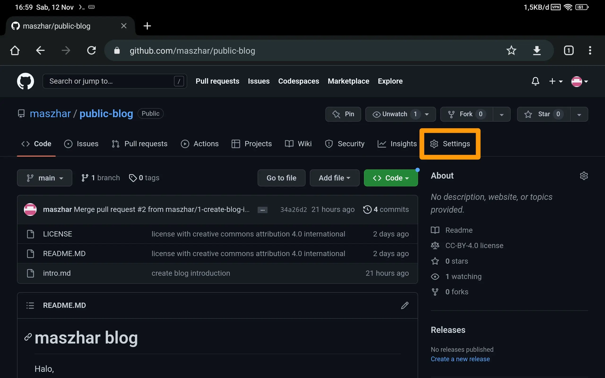
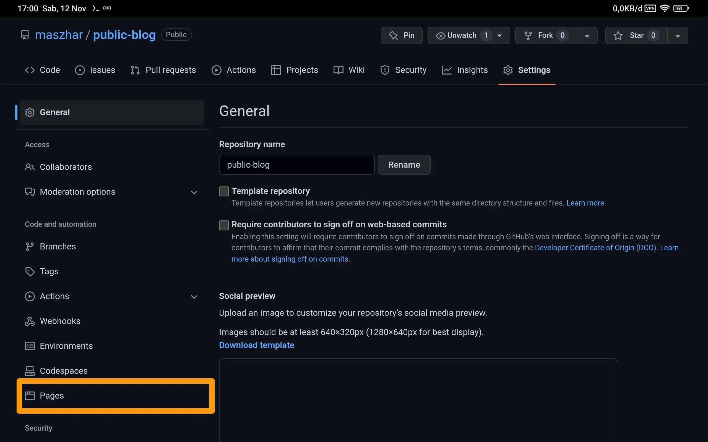
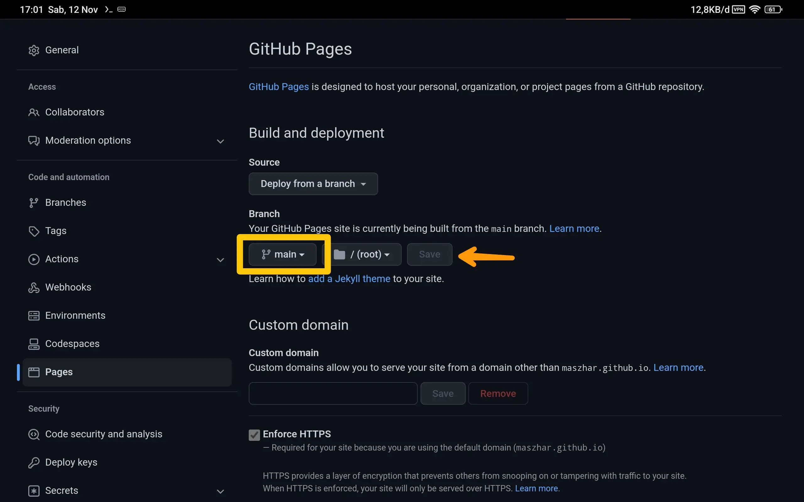
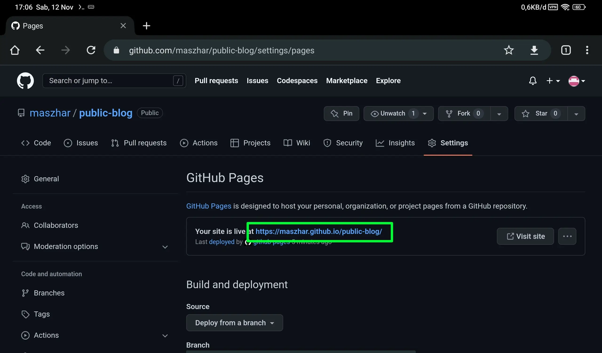
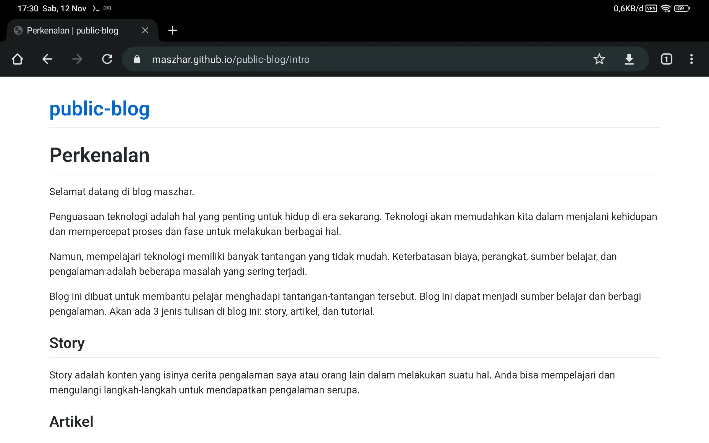

# Menampilkan File Markdown ke Website dengan Github Pages

Saya telah membuat beberapa *file* markdown sebagai konten dari blog. Lalu bagaimana agar konten tersebut dapat ditampilkan sebagai website?

Untungnya, GitHub menyediakan fitur pages yang dapat masalah itu. Fitur itu juga memberikan domain gratis sebagai alamat URL untuk mengakses blog.

Untuk mengaktifkan fiturnya, ikuti langkah-langkah berikut:

1. Buka repository GitHub yang akan digunakan sebagai website.

2. Klik tab `Settings`.

   Tab `Settings` berisi beberapa konfigurasi repository yang salah satunya adalah `Pages`.

   

3. Klik bagian `Pages`.

   Bagian `Pages` berisi konfigurasi untuk mengaktifkan dan mengatur fitur pages pada repository GitHub.

   

4. Tentukan sumber publikasi.

   Beri tahu GitHub harus menampilkan halaman website dari sumber mana. Di sini, saya atur dari branch `main`.

   Klik tombol `Save` untuk menyimpan konfigurasi.

   

5. Refresh halaman website.

   Link blog yang dapat diakses melalui internet akan ditampilkan pada halaman ini. Proses ini memerlukan waktu beberapa saat, jadi lakukan *refresh* secara berkala jika link belum ditampilkan.

   

6. Buka salah satu konten dengan link yang disediakan.

   Untuk membuka konten, gunakan link yang telah disediakan dan tambahkan nama *file* tanpa ekstensi.

   Sebagai contoh, saya ingin membuka file `intro.md`. Link yang saya dapatkan adalah `https://maszhar.github.io/public-blog/`. Maka saya perlu menuliskan URL pada browser sebagai berikut:

   ```text
   https://maszhar.github.io/public-blog/intro
   ```

   