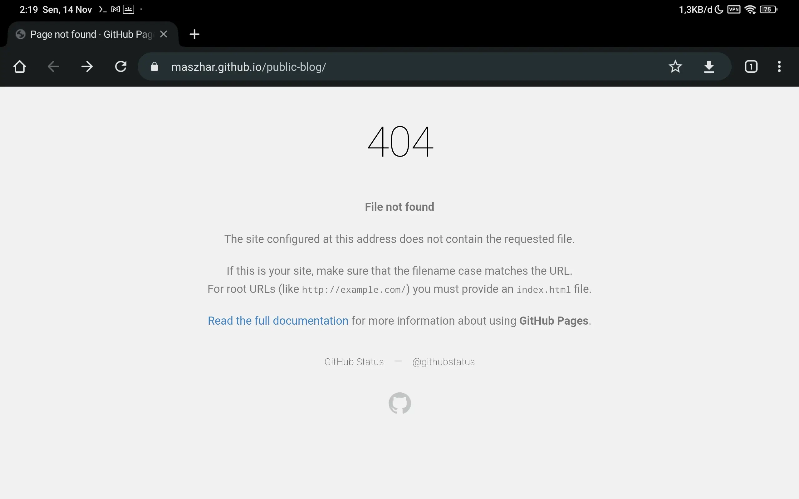
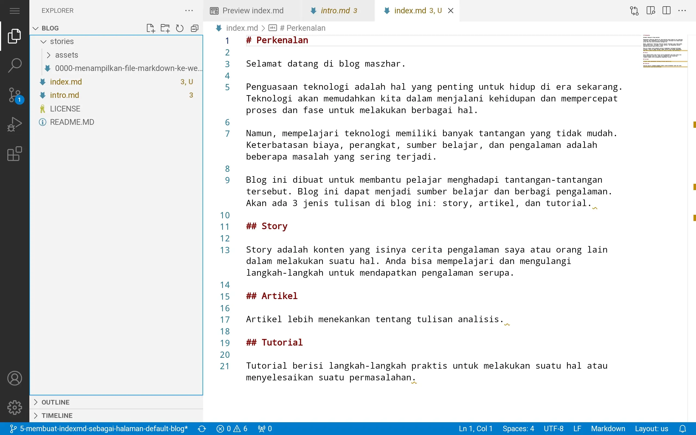
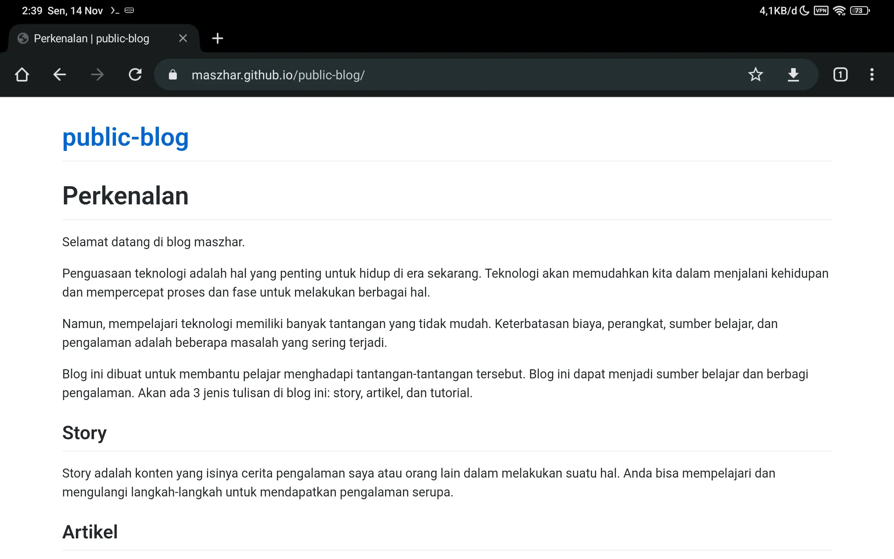

# Membuat Halaman index.md sebagai Halaman Default Blog

index.md adalah *file* yang akan dibuka ketika tidak ada path yang dituliskan pada URL saat mengakses website. Path adalah kata yang menunjukkan lokasi file yang diinginkan yang dituliskan setelah *domain* atau *base URL*.

Sebagai contoh, blog saya saat ini memiliki *base URL*  [https://maszhar.github.io/public-blog](https://maszhar.github.io/public-blog). Jika URL tersebut dibuka, akan ditampilkan error 404 Not Found seperti pada `Gambar 1`. Artinya, server tidak dapat menemukan lokasi dari *resource* yang diminta.

`Gambar 1`. Tampilan halaman **404 not found**.

*File* index.md dapat membuat tampilan ini menjadi halaman konten daripada halaman error *not found* ini. *File* tersebut disimpan pada direktori `root` yang sesuai dengan `Settings Page` repository. `Gambar 2` menunjukkan struktur file dari blog saya setelah ditambahkan index.md. Dapat dilihat, *file* index.md diletakkan di direktori terluar dari project.

`Gambar 2`. Struktur file blog

Kemudian, ketika *base URL* blog saya dibuka maka akan tampil seperti pada `Gambar 3`.

`Gambar 3`. Tampilan halaman *base URL*.