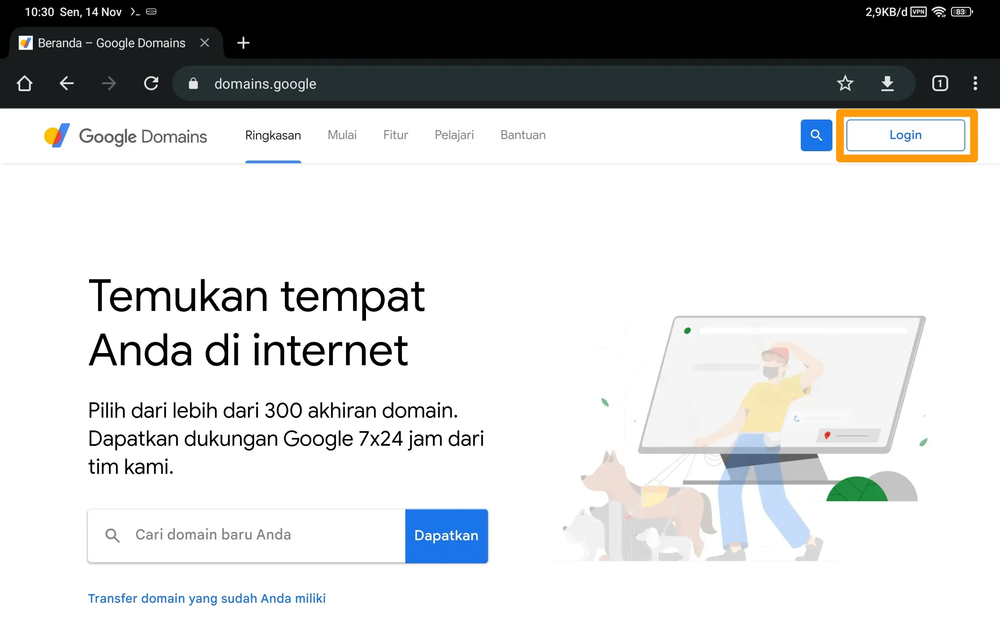
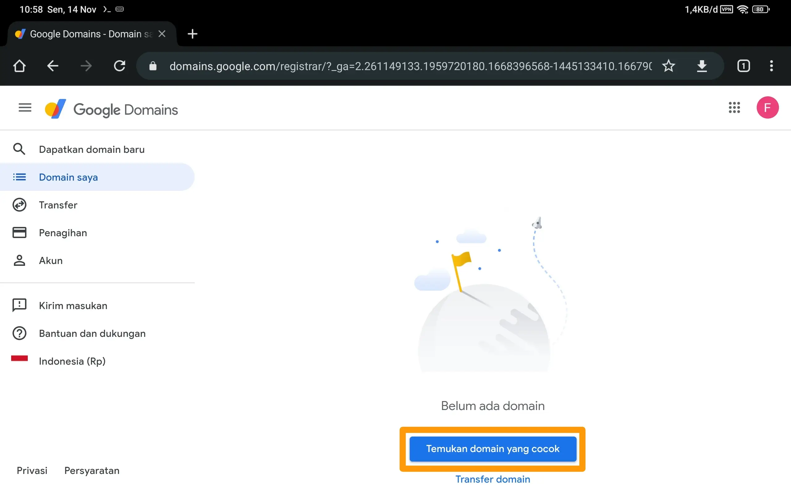
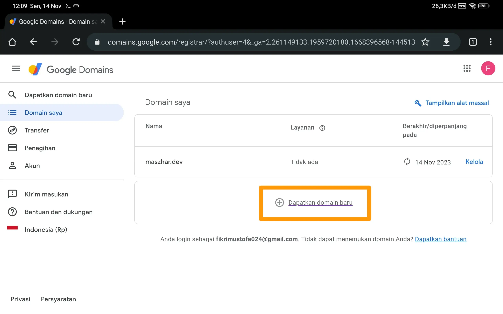
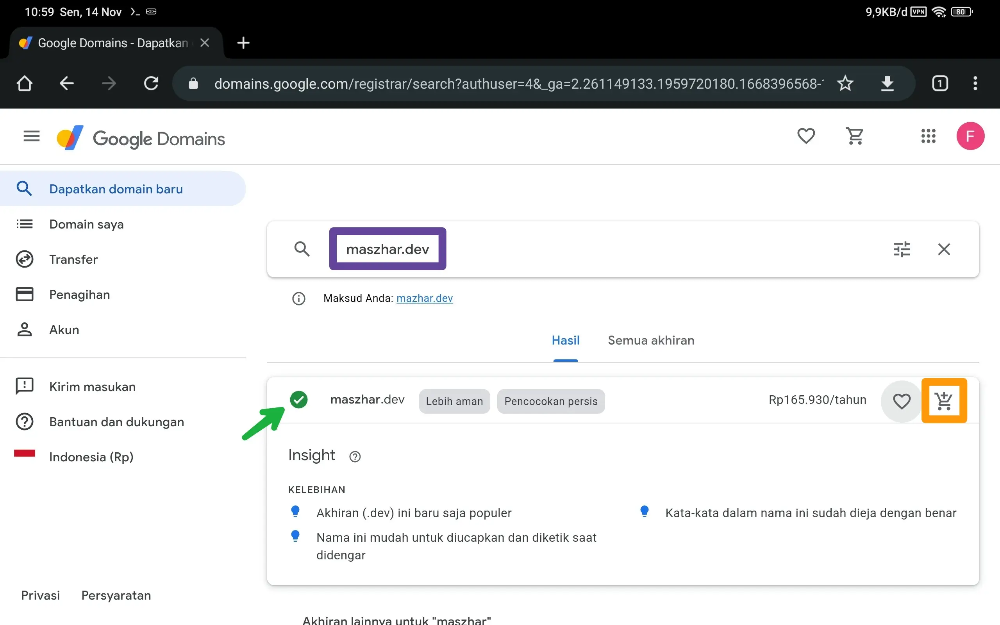
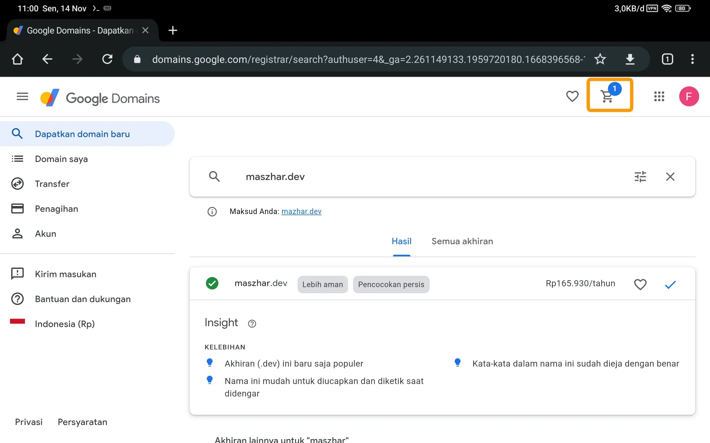
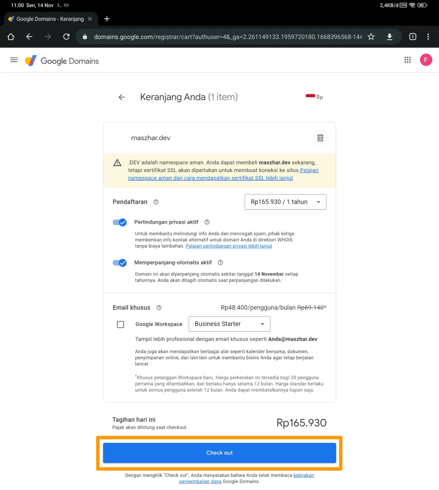
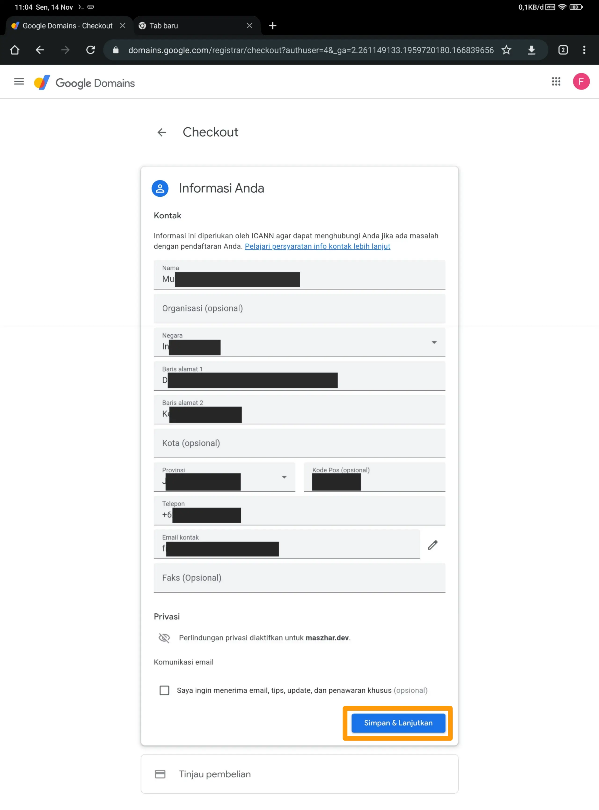
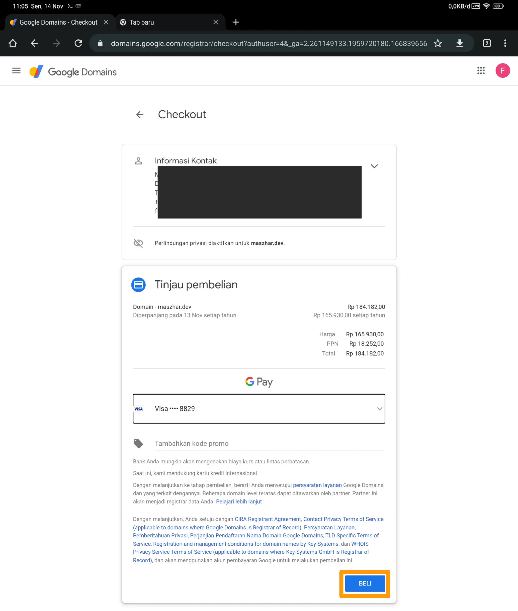
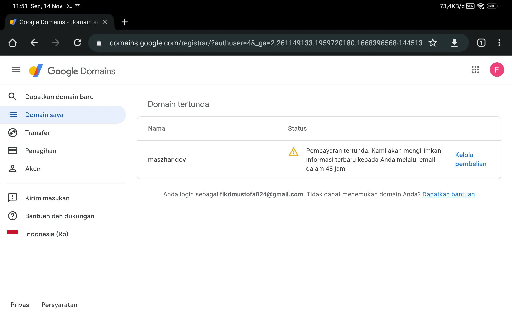
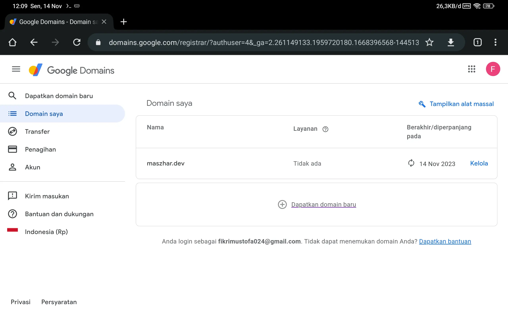

# Langganan Domain Name .dev di Google Domains

[\[TLDR\]: Main Action](#main-action)

Domain name adalah identitas di internet berupa nama yang digunakan untuk mengarahkan pengunjung ke suatu server. Server tersebut bisa berupa website, email, atau lainnya. Cara mendapatkannya adalah dengan berlangganan ke registrar.

Agar blog ini memiliki identitas yang tetap, maka perlu sebuah domain name. Harapannya adalah blog ini mudah ditemukan oleh pengunjung dan namanya mudah diingat sehingga pengunjung mudah untuk mengakses kembali.

## Main Action

Kali ini, saya akan melakukan langganan domain name `maszhar.dev` ke registrar `Google Domains`. Langkah-langkahnya sebagai berikut:

1. Buka link website [domains.google](https://domains.google).

   Kemudian login menggunakan akun Google Anda.

   

   `Gambar 1` Website google domains

2. Tambahkan domain name baru

   Halaman akan menampilkan daftar domain name yang sedang dilanggan. Untuk menambah domain name baru, klik `Temukan domain yang cocok` jika kondisi daftar kosong (`Gambar 2a`) atau klik `Dapatkan domain baru` jika daftar sudah terisi (`Gambar 2b`).

   

   `Gambar 2a` Tombol `Temukan domain yang cocok` ketika daftar domain name kosong

   

   `Gambar 2b` Tombol `Dapatkan domain baru` ketika daftar domain name terisi

3. Isikan domain name yang diinginkan pada kolom pencarian.

   Status ketersediaan domain name yang dicari akan ditampilkan. Status ketersediaan ditandai dengan simbol centang hijau sebelum nama domain. Jika tidak ada simbol tersebut, artinya domain tersebut telah dimiliki oleh orang lain dan  tidak bisa Anda gunakan. Selain itu, ditampikan juga rekomendasi domain lain yang juga masih tersedia.

   Klik simbol keranjang untuk memilih domain name.

   

   `Gambar 3` Pencarian domain name

4. Klik tombol keranjang di bagian atas untuk melihat semua domain name yang telah dipilih.

   

   `Gambar 4` Domain name pilihan telah masuk keranjang

5. Klik tombol `Checkout` untuk melanjutkan proses pembelian.

   

   `Gambar 5` Halaman keranjang

6. Masukkan data identitas diri Anda.

   Lalu klik tombol `Simpan & Lanjutkan`.

   

   `Gambar 6` Formulir identitas diri

7. Pilih metode pembayaran yang digunakan. Jika belum ada, Anda akan diminta untuk menambahkan metode baru. Baca syarat dan ketentuan terkait dengan layanan ini. Kemudian klik tombol `Beli`.

   

   `Gambar 7` Halaman checkout

8. Registrasi akan diproses dan memerlukan waktu. Tunggu hingga ada konfirmasi lanjut melalui email.

   

   `Gambar 8` Registrasi sedang diproses

   Setelah registrasi selesai diproses, domain name yang dipilih sudah resmi menjadi miliki pendaftar. Domain name tersebut akan ditambahkan pada daftar domain saya.

   

   `Gambar 9` Daftar domain setelah registrasi selesai
