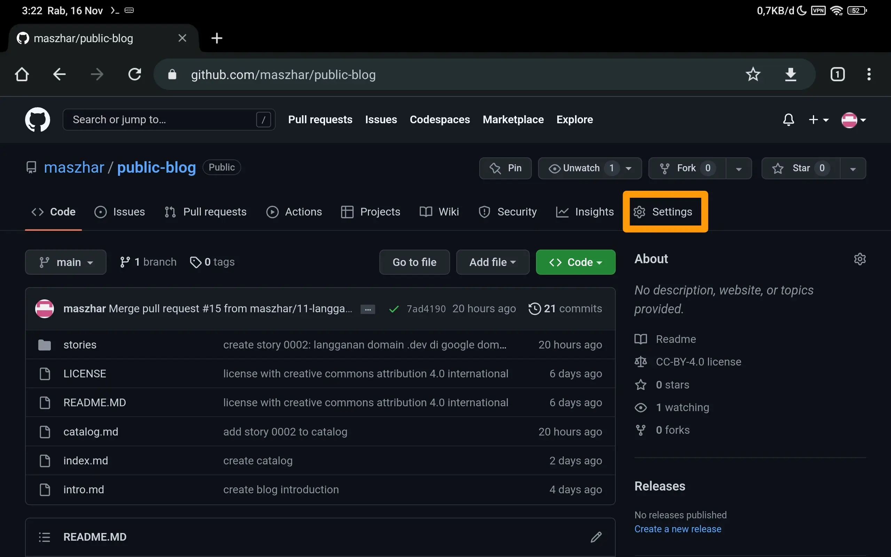
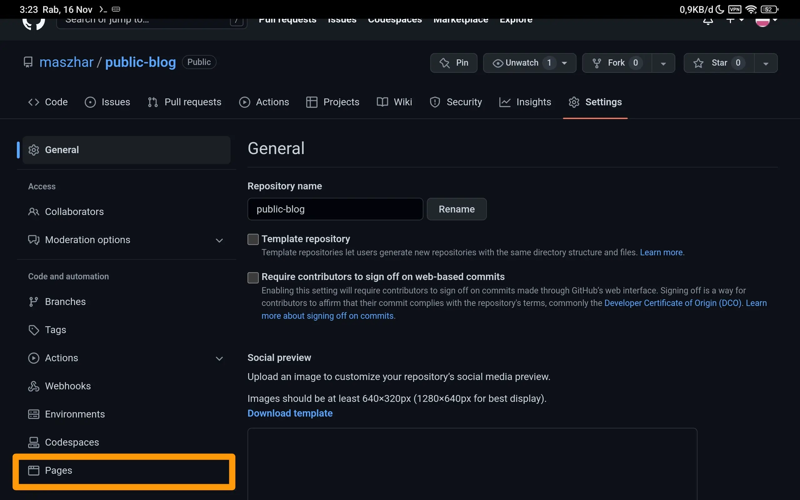
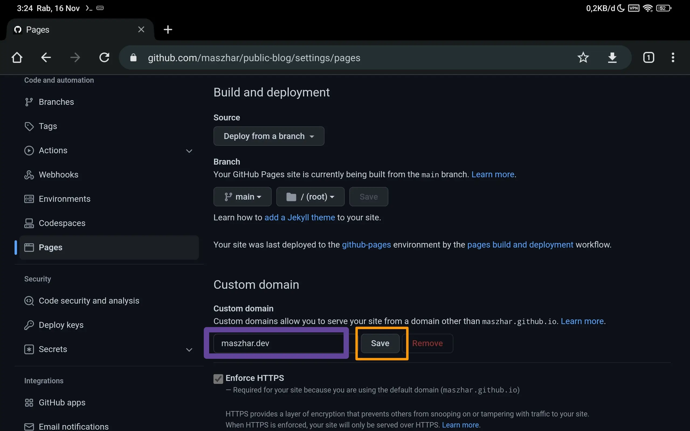
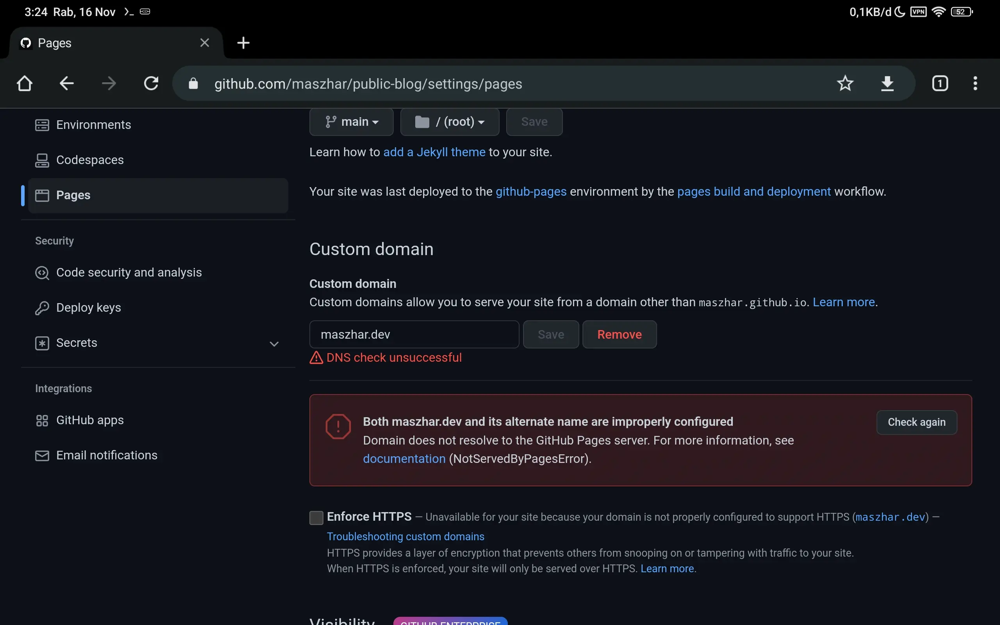
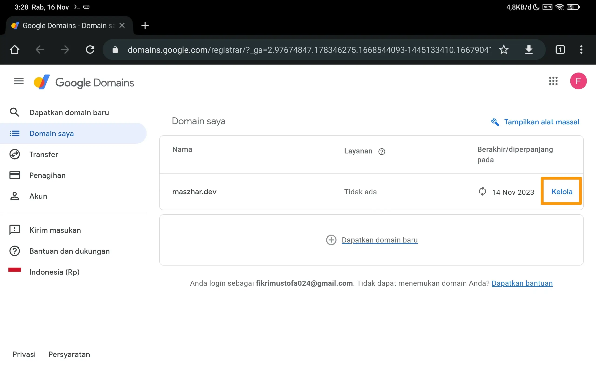
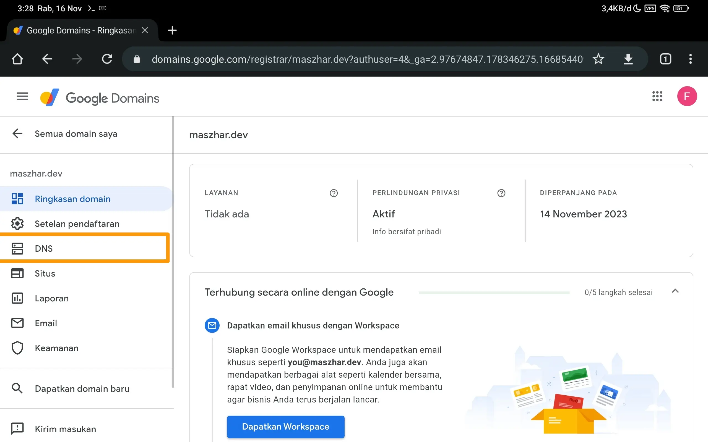
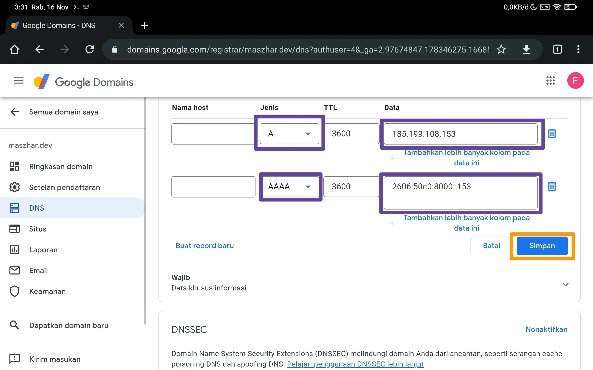
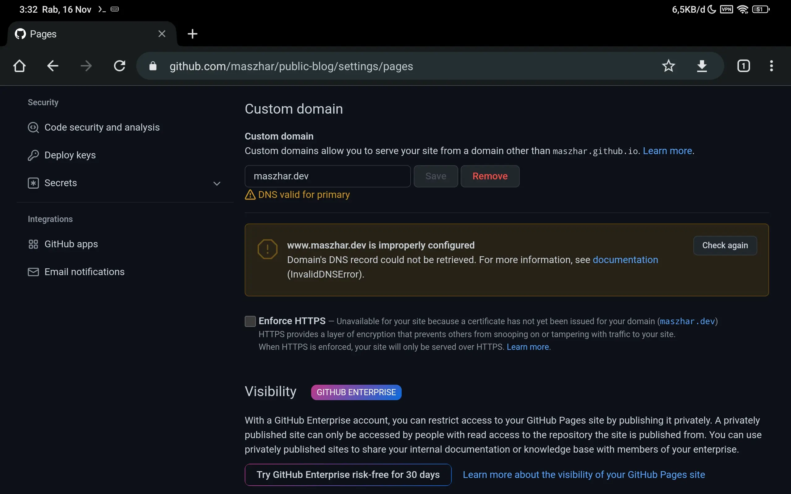
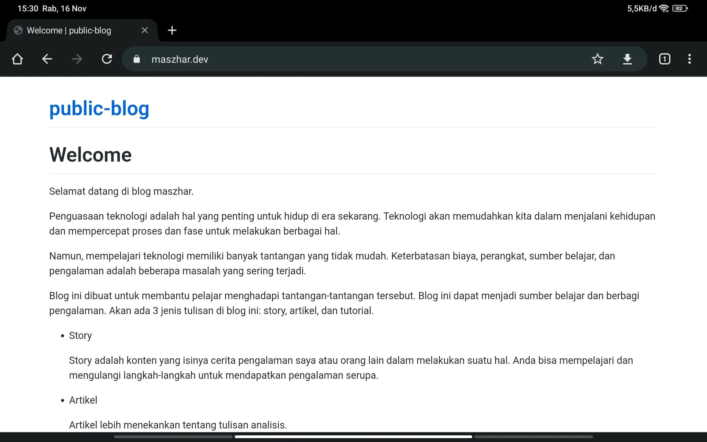

# Menggunakan Custom Domain untuk Github Pages

GitHub page mempunyai fitur Custom Domain agar page dapat diakses dengan domain name yang telah dimiliki.

Pada kesempatan ini, saya akan coba gunakan domain `maszhar.dev` agar dapat mengakses Github Pages pada repository blog ini.

## Konfigurasi GitHub Pages

1. Buka repository blog dan pilih tab `Settings`

   

   `Gambar 1` Settings repository

2. Pilih menu `Pages`

   

   `Gambar 2` Setting pages

3. Atur Custom Domain.

   Pada bagian **Custom Domain**, isikan text input dengan domain name yang telah dimiliki. Lalu klik `Save`.

   

   `Gambar 3` Konfigurasi custom domain

   Setelah itu akan ada pesan `DNS check unsuccessful` seperti yang terlihat pada `Gambar 4`. Di bawah pesan itu ada penjelasan bahwa domain maszhar.dev belum dikonfigurasi. Hal ini dikarenakan domain maszhar.dev belum dikonfigurasi untuk mengarah ke server GitHub page. Kita akan mengarahkannya pada tahapan bagian selanjutnya.

   

   `Gambar 4` DNS check unsuccessful.

## Konfigurasi DNS di Google Domains

Tujuan dari tahapan ini adalah agar domain name dapat menunjuk ke server GitHub pages. Sehingga, ketika pengunjung mengakses domain name tersebut, akan ditampilkan halaman blog yang sebelumnya telah diaktivasi fitur github pages-nya.

Langkah yang saya tuliskan adalah langkah konfigurasi jika menggunakan Google Domains karena sebelumnya saya melakukan langganan pada Google Domains. Apabila Anda menggunakan provider domain lain, kemungkinan caranya akan berbeda.

1. Buka [Google Domains](https://domains.google)

   Di halaman tersebut, akan ditampilkan daftar domain yang telah dimiliki. Klik tombol `Kelola` pada item domain yang akan dikonfigurasi.

   

   `Gambar 5` Daftar domain saya

2. Buka menu DNS

   

   `Gambar 6` Detail informasi domain

3. Masukkan entry DNS

   Berdasarkan [dokumentasi Github](https://docs.github.com/en/pages/configuring-a-custom-domain-for-your-github-pages-site/managing-a-custom-domain-for-your-github-pages-site), domain perlu diarahkan ke `185.199.108.153` dengan jenis `A` dan `2606:50c0:8000::153` dengan jenis `AAAA`.

   Kedua nilai tersebut adalah alamat dari server Github. Jenis `A` adalah tipe penunjuk dengan IPv4 dan jenis `AAAA` adalah tipe penunjuk dengan IPv6.  

   Untuk melakukannya, cari bagian **Data kustom** pada bagian **Data Resource**. Pilih jenis A, lalu masukkan `185.199.108.153` pada kolom **Data**. Biarkan kolom yang lain seperti semula.

   Kemudian klik `Buat Record Baru`. Lalu pilih jenis AAAA pada kolom baru dan isikan `2606:50c0:8000::153` pada kolom Data. Abaikan kolom yang lain. Klik tombol `Simpan`.

   Hasil konfigurasi kurang lebih seperti pada `Gambar 7`.

   

   `Gambar 7` Konfigurasi DNS

   **Note:**

   ```text
   Proses perubahan konfigurasi bisa memakan waktu hingga 24 jam.
   ```

## Verifikasi Konfigurasi

Jika halaman setting page pada Github di-*refresh*, pesan yang ditampilkan akan berbeda.



`Gambar 8` DNS valid for primary

Pada `Gambar 8` dapat dilihat bahwa pesan berubah menjadi **DNS valid for primary**.

Untuk memastikan konfigurasi sudah benar, kunjungi domain name yang dikonfigurasi pada *web browser*. Seharusnya, halaman github page akan ditampilkan seperti pada `Gambar 9`.



`Gambar 9` Tampilan blog dengan custom domain.
