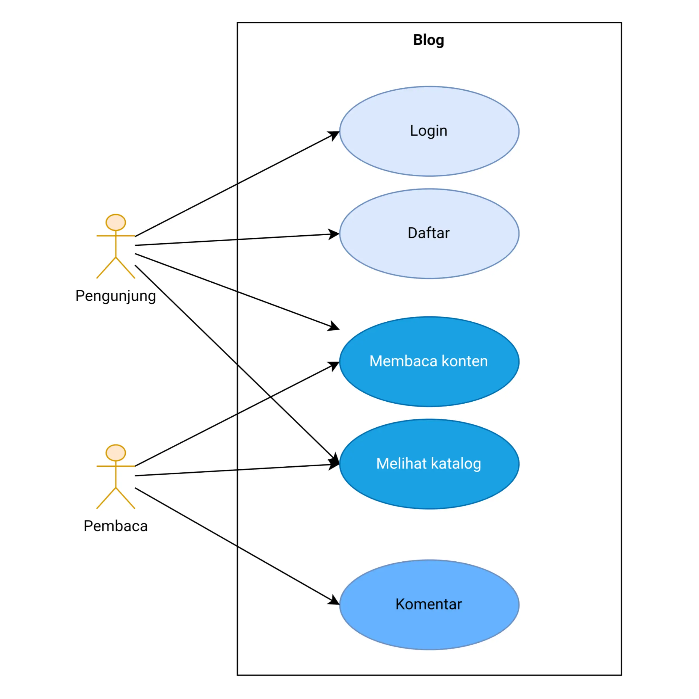

# Rancangan Project Markdown Blog

Well, blog ini setidaknya sudah bisa menampilkan konten yang bisa dibaca oleh pengunjung. Selain itu, blog ini telah memiliki custom domain. Namun, banyak fitur lain yang belum ada, misalnya blog ini belum bisa menerima feedback pembaca. Jadi, saya putuskan untuk merancang blog sendiri yang fiturnya dapat disesuaikan dengan kebutuhan.

## Requirements

Biasanya, requirement didapat dengan mewawancarai customer. Karena yang ingin membutuhkan project ini adalah saya sendiri, jadi saya akan langsung ceritakan saja.

```text
Saya ingin membuat blog yang kontennya akan dibuat dalam format markdown. Kenapa markdown? Karena syntax untuk menata dan memformat tulisan pada format tersebut menurut saya sederhana. Blog harus dapat menampilkan konten yang sudah rapi ke pengunjung yang mengakses melalui web browser. Di samping itu, blog juga harus bisa menampilkan katalog yang berisi daftar konten sehingga pengunjung bisa menemukan semua konten di blog ini.

Selain itu, saya juga perlu fitur agar pembaca bisa memberi feedback atau komentar terhadap tulisan saya. Sehingga saya jadi tahu apa yang kurang di tulisan saya atau mungkin pembaca kurang mengerti apa yang saya tuliskan. Kemudian saya atau pembaca lain bisa menambahkan komentar untuk saling berdiskusi.
```

Jadi kesimpulan *requirements*-nya adalah:

1. Pengunjung harus bisa melihat konten blog
2. Pengunjung harus bisa melihat katalog
3. Pembaca harus bisa menambahkan komentar
4. Pengunjung harus bisa registrasi dan login

Sebentar, bagaimana registrasi dan login bisa ada sedangkan di cerita tidak dijelaskan secara eksplisit? Kata `pembaca` diikuti `pembaca lain` menunjukkan bahwa entitas tersebut harus teridentifikasi. Salah satu cara mengidentifikasi adalah dengan registrasi dan login.

## Use Case Diagram

Jika requirements digambarkan menjadi use case diagram, hasilnya seperti pada `Gambar 1`.



`Gambar 1` Use case diagram blog
