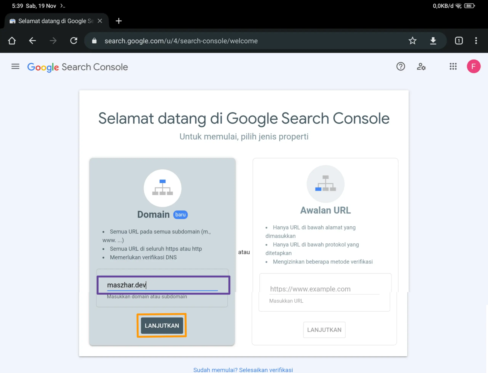
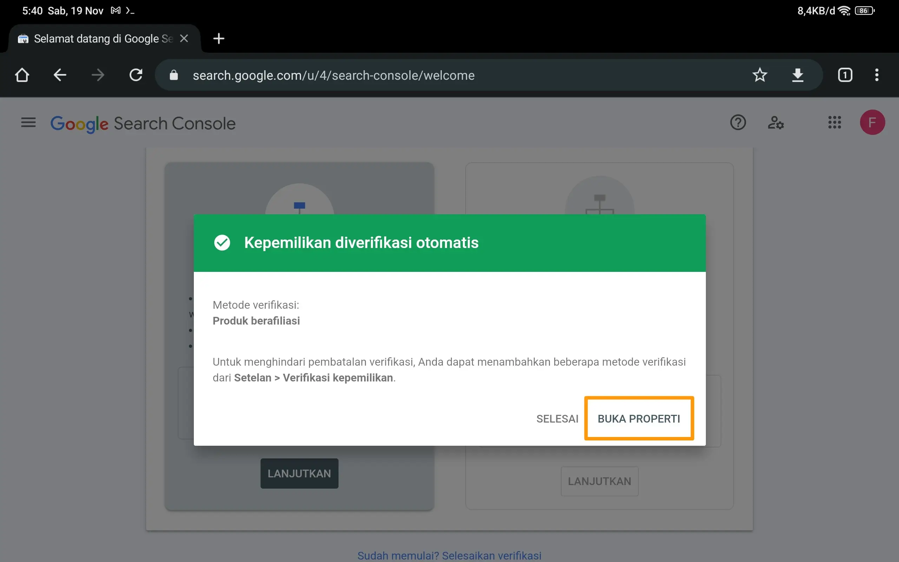
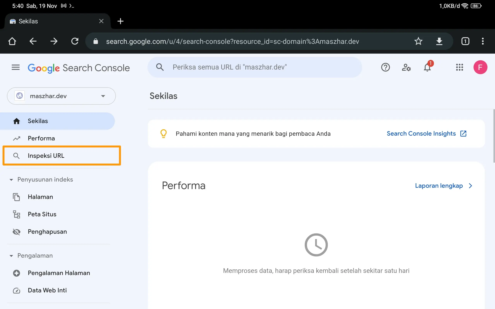
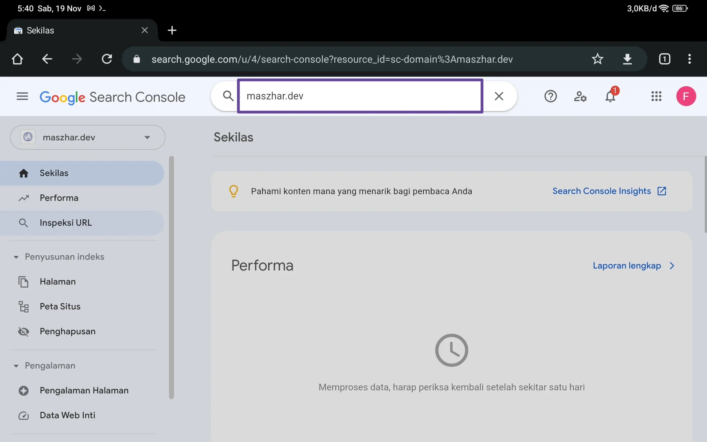
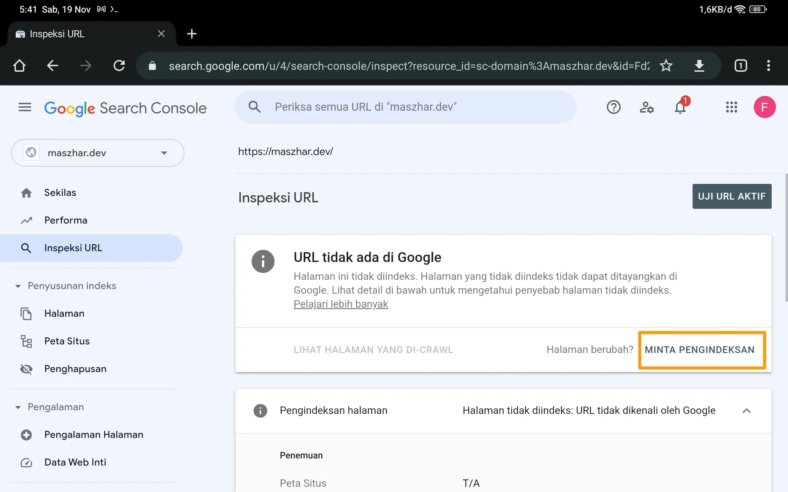
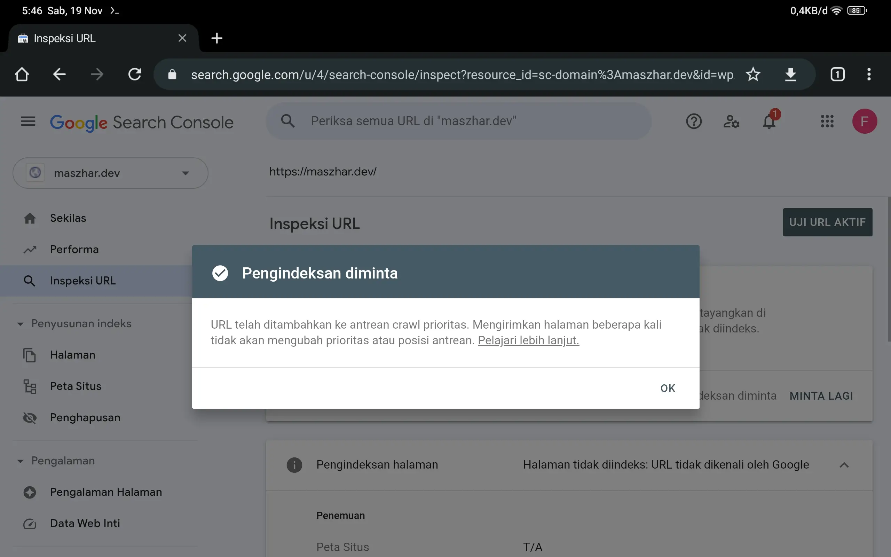

# Mendaftarkan Domain maszhar.dev pada Google Search Engine

[\[TLDR;\]](#action-zone)

Salah satu cara agar website mudah ditemukan adalah mendaftarkannya pada search engine. Search engine adalah program yang dapat membantu menemukan informasi dengan memasukkan kata kunci. Search engine dapat membantu menemukan website apabila pengguna memasukkan kata kunci yang sesuai dengan konten pada website tersebut.

Hal-hal yang perlu diperhatikan dalam memilih search engine adalah berapa yang memakai search engine dan sepopuler apa search engine tersebut. Jika pemakai search engine banyak, peluang agar website ditemukan juga tinggi.

Berdasarkan data dari [cloudwards.net](https://www.cloudwards.net/search-engine-statistics/#:~:text=What%20Percentage%20of%20People%20Use,%25%20and%20DuckDuckGo%20at%200.67%25.), search engine Google memiliki market 91,94% dari seluruh search engine pada Desember 2021. Karena itulah saya memilih Google search engine sebagai tempat pendaftaran domain maszhar.dev.

## Action Zone

Cara mendaftarkan domain di Google Search Engine adalah sebagai berikut:

1. Buka Search Console Google pada link [https://search.google.com/search-console](https://search.google.com/search-console)

2. Isikan domain name. Lalu klik `Lanjutkan`.

   

   `Gambar 1` Registrasi domain pada search console

3. Verifikasi domain name.

   Selanjutnya akan ditampilkan beberapa opsi untuk memverifikasi kepemilikan domain. Ikuti langkah-langkah tersebut.

   Karena saya mendaftar domain maszhar.dev pada google domain dengan akun google yang sama dengan google search console, kepemilikan secara otomatis terverifikasi.

   

   `Gambar 2` Domain terverifikasi

4. Minta pengindeksan

   Pada dashboard search console, klik menu `Inspeksi URL`.

   

   `Gambar 3` Dashboard search console

   Kemudian fokus akan berpindah ke search bar, masukkan domain name pada search bar itu.

   

   `Gambar 4` Masukkan domain pada search bar

   Pada halaman Inspeksi URL, tertulis `URL tidak ada di Google`. Untuk meminta google mengindeks domain, klik tombol `MINTA PENGINDEKSAN`.

   

   `Gambar 5` Minta pengindeksan

   Tunggu hingga ada konfirmasi Pengindeksan Diminta seperti pada `Gambar 6`.

   Sekarang, yang bisa dilakukan hanyalah menunggu proses pengindeksan sampai pada antrean kita, bisa berhari-hari bahkan berminggu-minggu.

   

   `Gambar 6` Pengindeksan diminta
