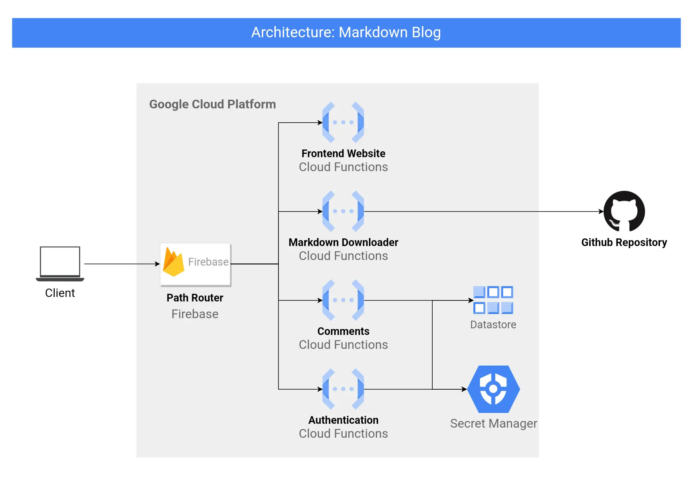

# Arsitektur Project Markdown Blog

Setelah mendapatkan [requirements](0004-rancangan-project-markdown-blog.md), saatnya melanjutkan ke tahap desain arsitektur. Arsitektur dari project yang akan dibuat adalah seperti pada `Gambar 1`.

`Gambar 1` Arsitektur project Markdown Blog

Project markdown blog akan dibangun pada Google Cloud Platform. Komponen-komponennya terdiri dari Firebase, 4 Cloud Functions, Datastore, dan Secret Manager.

## Firebase

Firebase akan berfungsi sebagai path router. Dia akan bertugas mengidentifikasi path dari paket request yang masuk, lalu memilih Cloud Function tujuan yang sesuai dengan path, kemudian meneruskan paketnya ke tujuan yang dipilih. Kemudian cloud function tujuan akan membalas dengan paket response, lalu firebase bertugas meneruskannya kembali ke client. Fitur firebase yang akan diaktifkan untuk mengerjakan fungsi tersebut adalah **hosting**.

## Cloud Functions

Cloud function akan dibuat dengan jumlah 4 buah. Masing-masing fungsinya adalah frontend website, markdown downloader, comments, dan authentication.

### Function Frontend Website

Function frontend website dibuat untuk menangani render halaman website dan download file statis. Ketika paket request yang berisi permintaan suatu halaman website datang dari firebase, function ini akan menyiapkan data-data yang diperlukan, kemudian me-*render* berkas HTML dan mengirimkan balasan kembali ke firebase. Sedangkan jika isi dari paket request adalah permintaan file statis, maka fungsi ini akan mengembalikan file tersebut ke firebase.

### Markdown Downloader

Function ini berfungsi untuk mendownload file markdown dari GitHub. Alasan pemilihan GitHub sebagai sumber file adalah karena saat ini, aset dari blog ini, baik konten, gambar, atau aset lain sedang berada di GitHub. Setelah file terdownload, dia bertugas mengonversikan link relatif yang ada di dalam file tersebut menjadi link absolut karena link relatif tersebut hanya dapat bekerja jika berada di lingkungan GitHub. Sedangkan saat ini, lingkungan kerjanya adalah Cloud Functions. Selanjutnya, hasil akhir akan dikirimkan kembali ke firebase.

### Authentication

Ini adalah fungsi yang menangani user login dan register. Fungsi ini terkoneksi dengan secret manager sebagai penyimpan kunci dan datastore sebagai penyimpan informasi akun.

### Comments

Fungsi ini bertugas menangani pembuatan komentar. Koneksi fungsi ini sama seperti [Authentication](#authentication). Koneksi secret manager diperlukan untuk mendapatkan kunci guna memverifikasi pengguna yang mengirimkan paket request. Sedangkan koneksi ke datastore dibutuhkan untuk menyimpan data komentar secara persisten dan mengambil kembali saat dibutuhkan.