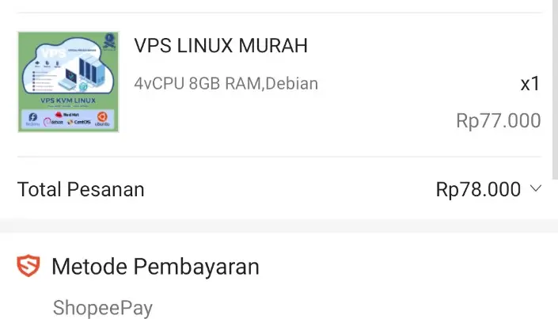
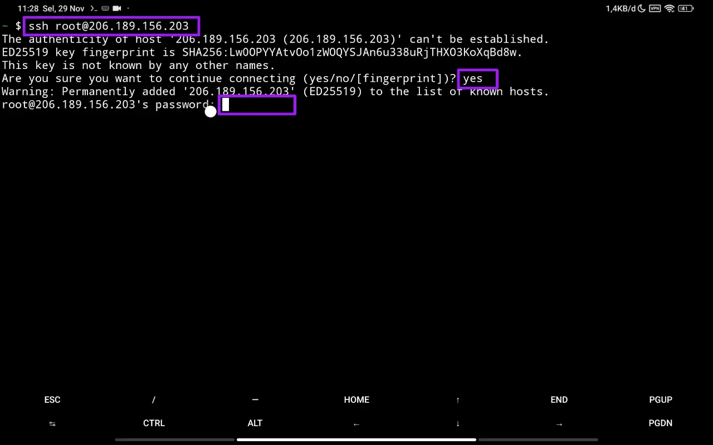
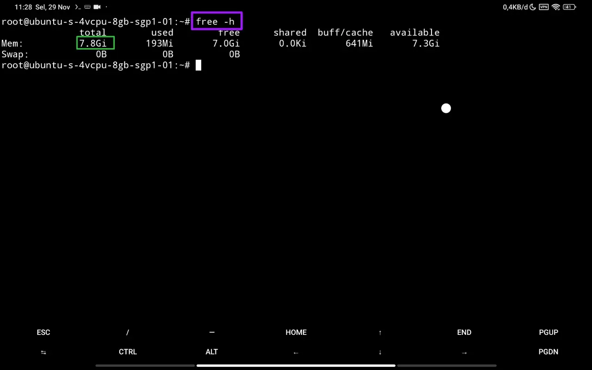
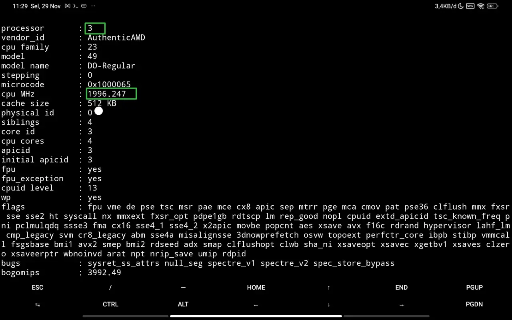
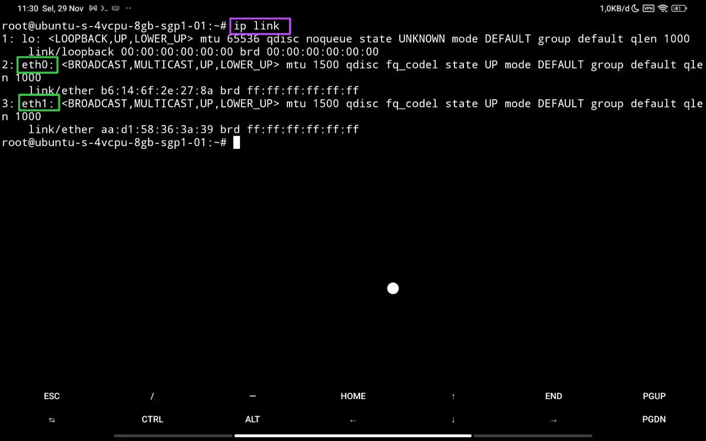
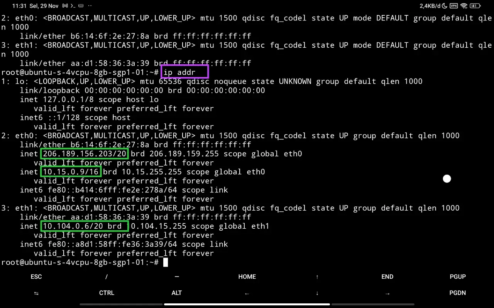

# Beli VPS murah di Marketplace

## Kronologi

Hari ini saya mencari jasa sewa VPS di marketplace. Barangkali ada yang harganya murah. Setelah sekian lama cari-cari, akhirnya saya temukan penjual VPS menawarkan harga lebih murah dari umumnya.

Karena penasaran, saya coba langganan satu bulan dengan harga Rp 77k. Spesifikasi servernya:

- 4 vCPU
- 8 GB RAM
- OS Debian



Beberapa saat setelah checkout pesanan, saya dikirim IP, username, dan password melalui fitur chat marketplace.


Jadi, sekarang saatnya dicoba.

## Sambungkan ke Server melalui SSH

Langkah awal untuk mengelola server linux adalah masuk ke Command Line Interface (CLI) server dengan Secure SHell (SSH).

Untuk melakukannya diperlukan aplikasi penyedia CLI. Di Windows bisa menggunakan Command Prompt atau PowerShell, Linux atau Mac dapat memakai Terminal, dan Android bisa pakai Termux. Selain itu, pastikan aplikasi SSH client sudah terinstal.

Buka aplikasi CLI, berikan perintah berikut:

```sh
ssh <username>:<server-host>
```

Ubah teks \<username\> dan \<server-host\> sesuai dengan informasi yang didapatkan dari penyedia server. Sehingga saya akan tuliskan menjadi:

```sh
ssh root@206.189.156.203
```

Jawab `yes` jika diminta konfirmasi fingerprint key. Kemudian masukkan password yang telah diberikan dan tekan Enter pada keyboard.



## Cek RAM

Pengecekan pertama adalah memastikan ukuran RAM nya sudah sesuai. Untuk cek RAM, beri perintah :

```sh
free -h
```



Pada gambar di atas, tertulis kapasitas Total RAM sebesar 7.8 Gi, mendekati 8 GB.

## Cek CPU

Selanjutnya adalah memastikan jumlah CPU benar 4 core. Perintahnya:

```sh
cat /proc/cpuinfo
```



Pada gambar tertulis `Processor: 3`. Informasi ini menunjukkan nomor processor yang perhitungannya dimulai dari angka 0. Artinya, ada 4 core processor. Sebenarnya di atas tulisan yang ada di gambar masih ada informasi dari 3 processor lainnya.

Speed dari masing-masing processor mendekati 2 GHz. Jika ditotal mendekati 8 GHz.

## Cek Network

### Cek Kondisi NIC

Network Interface Card (NIC) adalah perangkat jaringan baik fisik maupun virtual. Untuk mengecek NIC yang terpasang pada komputer, beri perintah:

```sh
ip link
```



Ternyata server ini memiliki 2 buah Ethernet atau colokan LAN.

### Cek IP address

Internet Protocol (IP) address adalah nomor unik sebagai alamat dari NIC. Cara cek konfigurasi IP:

```sh
ip addr
```



Pada gambar, tertulis bahwa ada 1 NIC yang memiliki alamat IPv4 public dan yang lainnya hanya punya alamat IPv4 private.

## Closing

Dari hasil pengecekan, menurut saya, VPS ini sudah cukup akurat dengan spesifikasi yang ditawarkan. Tapi ada 1 yang saya temukan tidak cocok, yaitu OS nya Ubuntu. Untungnya, OS tersebut satu keluarga dengan Debian, jadi bisa saya maklumi.

Saya akan gunakan dulu servernya untuk develop project markdown blog. Setelah itu akan saya review.
