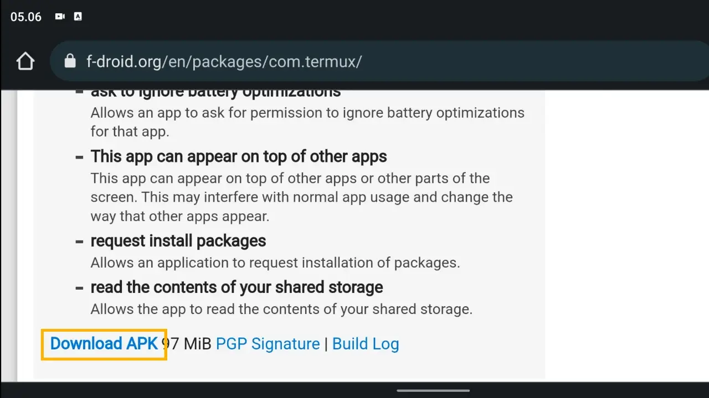
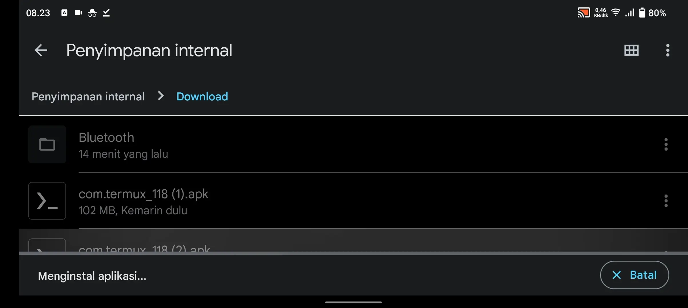
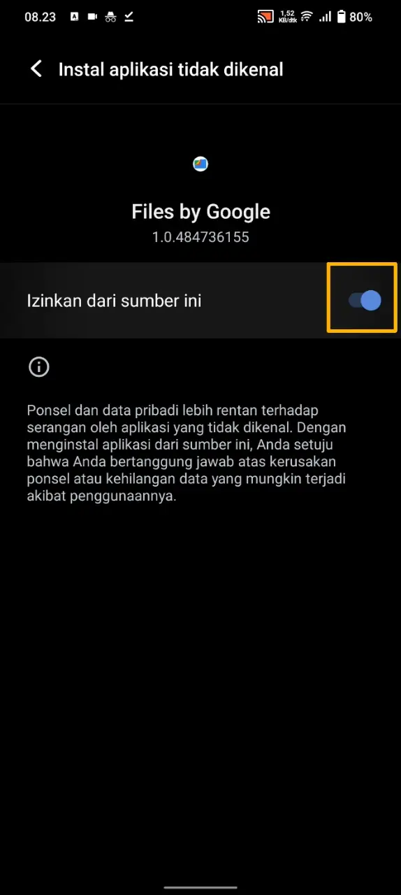
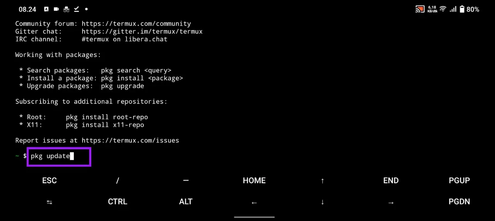
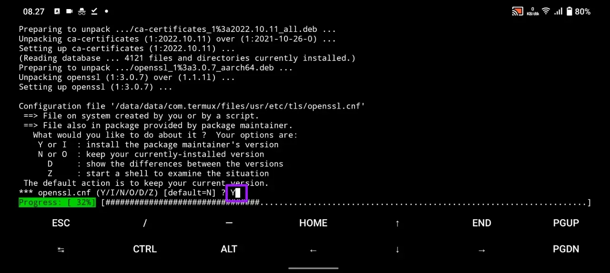

# Bagaimana Cara Install Termux di Android?

## Goal

Termux terinstal pada perangkat Android

## Gambaran

Termux adalah emulator terminal yang berfungsi untuk menyediakan interaksi dengan Android melalui command line.

OS Android adalah sistem operasi berbasis linux. Sebagian aplikasi di linux yang hanya berjalan di Command Line Interface. Sehingga termux cocok untuk menangani masalah itu.

## Langkah-langkah

Ada 3 langkah untuk menginstal termux:

1. Download termux
2. Instal file Android Package Termux
3. Update termux packages

### Step 1: Download Termux

Termux bisa didownload di F-Droid. Di play store memang ada termux, namun tidak disarankan karena developer mengupdate versi terbarunya di F-Droid. Link download: [https://f-droid.org/en/packages/com.termux/](https://f-droid.org/en/packages/com.termux/). Lihat gambar di bawah untuk letak tombol downloadnya.



### Step 2: Instal file APK Termux

Cara instalnya cukup mudah. Buka file apk Termux yang telah didownload.



**Catatan :**

Sebagian perangkat mungkin butuh izin "instal aplikasi sumber tak dikenal". Izinkan melalui Pengaturan perangkat Anda.



### Step 3: Update termux packages

Sampai tahap ini, pastikan Termux telah terpasang.

Update termux packages diperlukan agar semua aplikasi di dalamnya menggunakan versi terbarunya. Sehingga tidak terjadi error atau permintaan update saat penggunaan termux.

Cara updatenya:

1. Buka Termux
2. Tuliskan perintah dibawah, diikuti tombol `Enter` pada keyboard

   ```bash
   pkg update
   ```

   

3. Jika ada pertanyaan saat proses update, jawab dengan `Y`. Lalu tekan `Enter`.

   

## Closing

Demikian cara instalasi termux pada Android. Selanjutnya, Anda dapat mempelajari dasar-dasar perintah Linux agar bisa mengeksplorasi lebih jauh penggunaan Termux.
