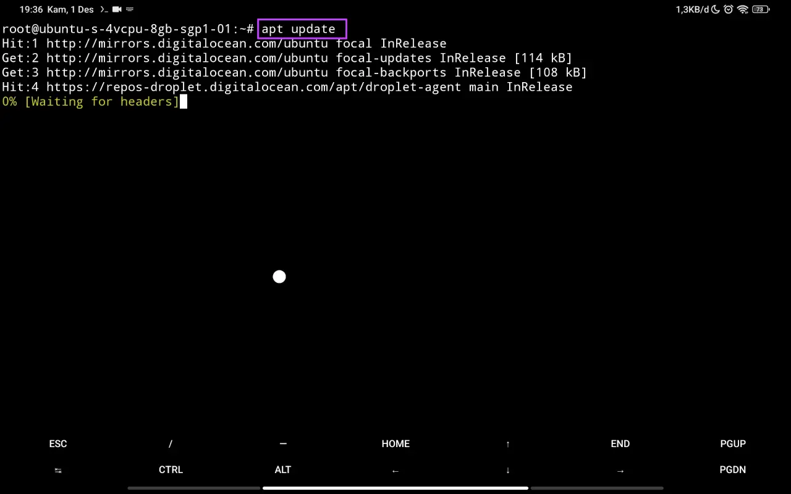
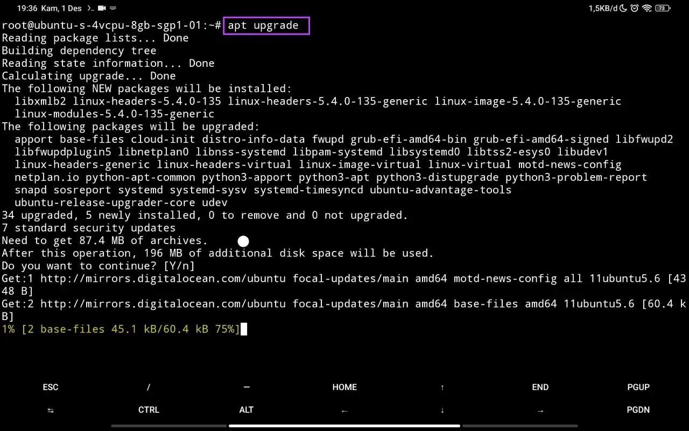
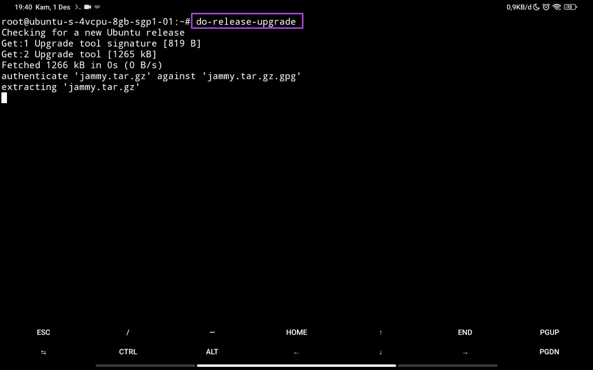
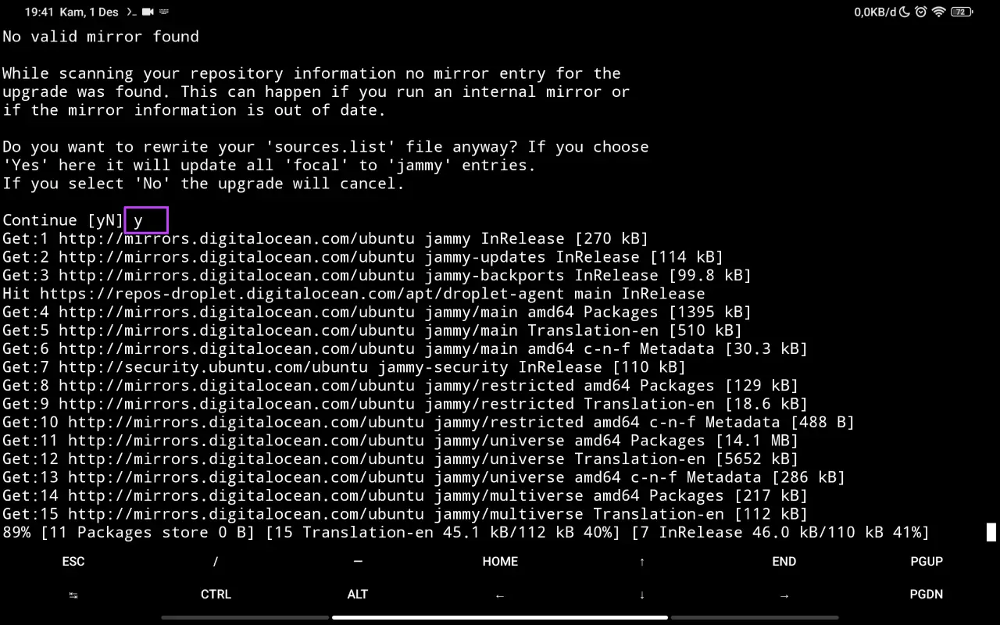

# Bagaimana Cara Upgrade Ubuntu 20.04 ke 22.04?

## Goal

- Versi Ubuntu menjadi 22.04

## Langkah-langkah

1. Upgrade packages
2. Upgrade Ubuntu

### Step 1: Upgrade Packages

Upgrade packages diperlukan sebelum bisa mengupgrade Ubuntu. Upgrade packages yang terinstal di Ubuntu dilakukan dengan 2 tahap:

1. Update repository

   Tujuan dari tahap ini adalah memperbarui daftar informasi packages yang berada di penyimpanan lokal. Update ini akan digunakan ketika proses upgrade sehingga Ubuntu bisa memilah packages mana saja yang perlu dilakukan upgrade.

   Perintah untuk melakukan update repository:

   ```sh
   sudo apt update
   ```

   

2. Upgrade packages

   Tahap selanjutnya adalah upgrade packages yang versinya sudah lama.

   Perintah untuk melakukannya:

   ```sh
   sudo apt upgrade
   ```

   

### Step 2: Upgrade Ubuntu

Setelah semua siap, berikan perintah berikut untuk memulai proses upgrade Ubuntu:

```sh
do-release-upgrade
```



Ketika proses upgrade, akan ada beberapa pertanyaan yang perlu dijawab. Jika Anda tidak mengerti maksud pertanyaannya, silakan jawab `y` untuk semua pertanyaan.



## Closing

Setelah proses upgrade selesai, Anda dapat mengecek versi Ubuntu saat ini dengan memberi perintah:

```sh
lsb_release -a
```

Pastikan package `lsb-release` sudah terinstal sebelum memberikan perintah tersebut.
